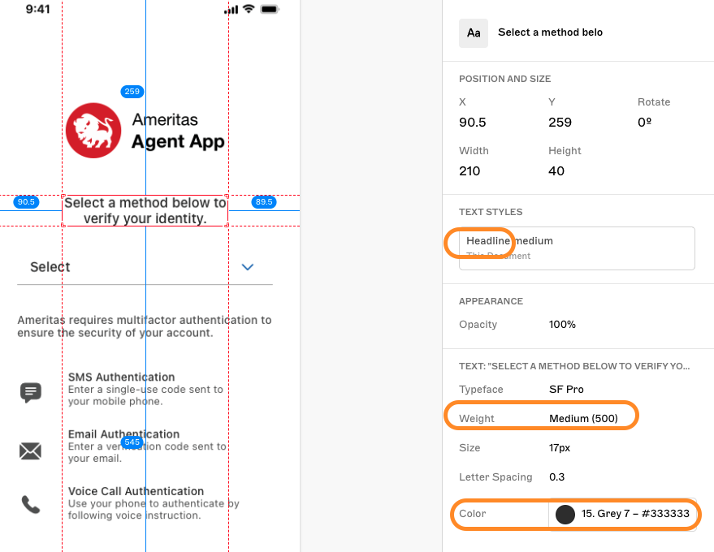

# Okta Swift UI Module
This module contains Ameritas specific Okta screens and logic to handle a custom connection. 

### **<span style="color:orange">Dependency Modules</span>**
This module requires the inclusion of 2 additional modules (OktaAuthNative and OktaOidc)

### **<span style="color:orange">K.BrandColors and K.getColor()</span>**
The following table helps translate the Sketch design hex colors with the matching brand colors.  Use this to color the SF Images.
The `K.getColor` takes in the `CustomColorScheme` enum and whether the OS is in DARK or not, and translates the color.

| Color Hex | K.BrandColor (Light) | K.getColor() | Matching in Dark |
| --- | --- | --- | --- |
| #000000 | .black | `.contrast` | .white |
| #FFFFFF | .white | `.reverse` | .black |
| #595959 | .lightDarkGray | `.lightDarkGray` | .primaryLightGrey |
| #333333 | .secondaryBlack | `.secondaryBlack` | .white |
| #767676 | .primaryLightGrey | `.primaryLightGrey` | .white |
| #D3222A | .redError | `.redError` | .lightRedError |
| #9C9C9C | .grey | `.grey` | .darkGrey |
| #0758AC | .blue | `.blue` | .lightBlue |
| #32571A | .green | `.green` | .darkGreen |
| #E36A00 | .orange | `.orange` | .lightOrange |
| #E8E8E9 | .lightGrey |  |  |
| #838387 | .darkGrey |  |  |
| #F9F9F9 | .veryLightGrey |  |  |
| #BE6064 | .lightRedError |  |  |
| #32571A | .darkGreen |  |  |
| #F3AF22 | .lightOrange |  |  |

### **<span style="color:orange">View Modifier</span>**
The following table helps translate the Sketch design.  Check the text values in image and then check table for corresponding modifier.  For example:


<table>
    <thead>
        <tr>
            <th>Screenshot</th>
            <th>Resolves to:</th>
        </tr>
    </thead>
    <tbody>
        <tr>
            <td></td>
            <td><code>Headline, medium, #333333 = .headlineDark()</code></td>
        </tr>
    </tbody>
</table>

The code would look like:
```
//-----------------------------------------------
// Draw message
Text(getMsg())
    .multilineTextAlignment(.center)
    .headlineDark()
    .padding(EdgeInsets(top: 10, leading: 80, bottom: 30, trailing: 80))
    .accessibilityLabel(getMsg())
    .accessibilityAddTraits(.isStaticText)
    .accessibilityIdentifier("Okta-Label")
```

| Font.TextStyle | Weight | Color (light) | Custom View Modifier |
| --- | --- | --- | --- |
| largeTitle |  |  |  |
| title | medium | (#000000) - .contrast | `.titleContrast()` |
| title | medium | (#595959) - .lightDarkGray | `.titleGrey()` |
| title2 |  |  |  |
| title3 |  |  |  |
| headline | medium | (#333333) -.secondaryBlack | `.headlineDark()` |
| subheadline |  |  |  |
| body | medium | (#000000) - .contrast | `.bodyContrast()` |
| body | medium | (#FFFFFF) - .reverse | `.bodyReverse()` |
| body | medium | (#595959) -.lightDarkGray | `.bodyGrey()` |
| body | regular | (#595959) -.lightDarkGray | `.bodyGreyReg()` |
| body | regular | (#000000) - .contrast | `.labelContrast()` |
| body | regular | (#333333) -.secondaryBlack | `.labelDark()` |
| callout |  |  |  |
| footnote | regular | (#595959) -.lightDarkGray | `.footnote()` |
| footnote | medium | (#333333) -.secondaryBlack | `.footnoteHdr()` |
| caption |  |  |  |
| caption2 |  |  |  |


